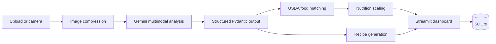

# 🍽️ FoodLens AI

A resume-ready multimodal AI project that turns a food image into:

- Structured food and dish detection
- Estimated serving sizes
- Nutrition estimates from USDA FoodData Central
- Personalized recipe ideas
- Downloadable JSON results
- Local analysis history

The default project uses **Gemini 2.5 Flash** for image reasoning and recipe generation, **USDA FoodData Central** for nutrition data, and **Streamlit** for the UI. Both APIs can be used through free access tiers/keys, subject to provider quotas and regional availability.

> Important: This is an educational project. It must not be used for allergy safety decisions, diagnosis, or medical nutrition planning.

## Architecture



## Main features

- Upload JPG, PNG, WebP, or take a camera photo
- Multimodal food recognition with confidence and uncertainty
- Composite-meal breakdown into searchable components
- USDA nutrition lookup with retry and rate-limit handling
- Calories, protein, carbohydrates, fat, fiber, sugar, and sodium
- Manual correction of food name and serving grams
- Personalized recipes based on diet and cuisine preferences
- SQLite analysis history
- JSON export
- Unit tests, Dockerfile, GitHub Actions CI
- Optional local CLIP zero-shot embedding module

## 1. Prerequisites

Install:

- Python 3.11 or 3.12
- VS Code
- Git

Python 3.13 may work, but Python 3.11 is recommended for the broadest AI-library compatibility.

## 2. Get the free API keys

### Gemini API key

1. Open Google AI Studio.
2. Create an API key.
3. Keep the key private and do not commit it to GitHub.

### USDA FoodData Central key

`DEMO_KEY` is included for initial testing and has low limits. For regular use, create your own free data.gov key through the USDA FoodData Central API-key signup page.

## 3. Open the project in VS Code

```powershell
cd path\to\foodlens_ai_project
code .
```

## 4. Create a virtual environment on Windows

```powershell
py -3.11 -m venv .venv
```

### Recommended activation-free method

This method works even when PowerShell script execution is disabled:

```powershell
.\.venv\Scripts\python.exe -m pip install --upgrade pip
.\.venv\Scripts\python.exe -m pip install -r requirements.txt
```

Optional activation in Command Prompt:

```bat
.venv\Scripts\activate.bat
```

## 5. Configure secrets

Copy `.env.example` to `.env`:

```powershell
Copy-Item .env.example .env
```

Edit `.env`:

```env
GEMINI_API_KEY=your_real_key_here
USDA_API_KEY=your_real_usda_key_or_DEMO_KEY
GEMINI_MODEL=gemini-2.5-flash
DATABASE_PATH=data/foodlens.db
```

Never commit `.env`.

## 6. Run the project

```powershell
.\.venv\Scripts\python.exe -m streamlit run app.py
```

The browser should open at `http://localhost:8501`.

You may also double-click `run_windows.bat`, or run:

```powershell
powershell -ExecutionPolicy Bypass -File .\run_windows.ps1
```

## 7. How the application functions

1. The user uploads or photographs a meal.
2. Pillow validates, rotates, resizes, and compresses the image.
3. Gemini receives the image with a constrained food-analysis prompt.
4. Gemini returns JSON validated against the `FoodAnalysis` Pydantic schema.
5. The app searches USDA FoodData Central for every detected component.
6. It selects the closest reference food using text similarity and data-type priority.
7. USDA values per 100 g are multiplied by the AI-estimated grams.
8. Gemini creates recipes using detected foods and user preferences.
9. Streamlit displays detection, nutrition, recipes, and raw JSON.
10. The user can correct food names or grams and rerun USDA calculation.
11. Results are saved locally in SQLite.

## 8. Test the code

Run offline unit tests:

```powershell
.\.venv\Scripts\python.exe -m pytest -q
```

Run the smoke test:

```powershell
.\.venv\Scripts\python.exe scripts\smoke_test.py
```

## 9. Optional CLIP embeddings

The default app uses Gemini's native multimodal reasoning. To demonstrate local vision embeddings too:

```powershell
.\.venv\Scripts\python.exe -m pip install -r requirements-clip.txt
```

`src/clip_service.py` contains a local CLIP zero-shot label-ranking function using `openai/clip-vit-base-patch32`. This is optional because PyTorch and model weights are large. Add its top labels to the dashboard as an extension.

## 10. Docker

```powershell
docker compose up --build
```

Open `http://localhost:8501`.

## 11. Deploy on Streamlit Community Cloud

1. Push this repository to GitHub without `.env`.
2. Create a new Streamlit Community Cloud app.
3. Set the main file to `app.py`.
4. Add secrets using the format in `.streamlit/secrets.toml.example`.
5. Deploy and test camera/upload permissions.

SQLite storage on free hosting may be ephemeral. Use PostgreSQL or another managed database for persistent production history.

## 12. Suggested GitHub repository structure

```text
foodlens_ai_project/
├── app.py
├── src/
│   ├── models.py
│   ├── vision_service.py
│   ├── nutrition_service.py
│   ├── recipe_service.py
│   ├── database.py
│   └── utils.py
├── tests/
├── scripts/
├── docs/
├── .github/workflows/ci.yml
├── .streamlit/config.toml
├── requirements.txt
├── Dockerfile
└── README.md
```

## 13. Troubleshooting

### `GEMINI_API_KEY is missing`
Create `.env`, save the key, stop Streamlit with `Ctrl+C`, and run it again.

### Gemini `429` or quota error
Free quotas are limited and may differ by account, model, project, or region. Retry later, inspect AI Studio usage, or select another currently free model in the sidebar.

### USDA `429`
`DEMO_KEY` has low shared limits. Add your own free USDA key.

### PowerShell says scripts are disabled
Do not activate the environment. Run the virtual environment's Python executable directly:

```powershell
.\.venv\Scripts\python.exe -m streamlit run app.py
```

### `No module named google.genai`
Ensure you installed `google-genai`, not only the older `google-generativeai` package:

```powershell
.\.venv\Scripts\python.exe -m pip install -r requirements.txt
```

### Incorrect nutrition
Food recognition and portion size are estimates. Use the correction editor, enter a more specific food name, and set the known weight.

## 14. Resume content

See `docs/resume_bullets.md`. Measure accuracy and latency using `docs/evaluation_plan.md` before adding numerical claims.

## Data and API notes

- USDA FoodData Central data are public domain/CC0. Attribute USDA FoodData Central in your project.
- Keep API keys out of GitHub.
- Free API quotas and available Gemini models can change.
