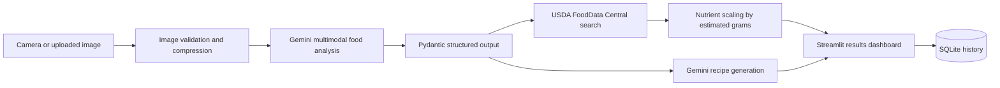

# Architecture

## Request flow

1. Streamlit receives a JPG, PNG, WebP, or camera image.
2. Pillow corrects EXIF orientation, resizes the image, and converts it to JPEG.
3. Gemini returns a validated `FoodAnalysis` JSON object.
4. Each detected food is matched against USDA Foundation, SR Legacy, or FNDDS records.
5. Nutrients per 100 g are scaled by the estimated portion weight.
6. Gemini generates recipes based on the detected foods and user preferences.
7. Results are displayed and stored locally in SQLite.

## Reliability controls

- Strict Pydantic schemas for model outputs.
- API timeouts and retries for USDA calls.
- Manual correction of detected food names and serving grams.
- No hardcoded secrets.
- Tests for nutrition scaling and image preprocessing.
- Explicit uncertainty and safety disclaimers.
